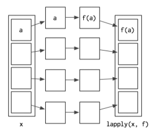
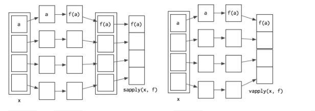

## apply family

資料處理的過程中，總是會遇到需要重複處理的，時常需要透過迴圈來做重複執行，但 R 裡的 apply 族是內嵌的函數，也不需要額外 package，卻可以透過 apply 族來處理 arrays, data frames, matrices, vectors 等等，apply 族是包裹迴圈後的產品，所以相對於向量化的計算並不會比較快，但是代碼會簡潔很多


🙂 下面是所有的 apply 族

| 函數   | 輸入                             | 輸出                    |
| ------ | -------------------------------- | ----------------------- |
| apply  | matrix \| data frame             | vector \| list \|array  |
| lapply | vector \| list \| dataframe      | list                    |
| sapply | vector \|list \|dataframe        | vector \| matrix        |
| mapply | multi(vector \|list \|dataframe) | list \| vector \|matrix |
| vapply | vector \|list \|dataframe        | vector \|matrix         |
| tapply | vector \|list \|dataframe        | vector                  |
| eapply | list                             | list                    |
| rapply | 嵌套清單                         | 嵌套清單                |

## apply

apply 會將 FUN 嵌套到每個 input 的元素，但要指定以行計算還是列計算

> apply(X, MARGIN, FUN, ...)

X: 就是輸入的矩陣或 data frame

MARGIN: 指定計算要 by row 還是 by column（row = 1, column = 2）

FUN: 要嵌套到每個元素的函數

...: addition arguments to FUN

**注意如果 x 不是 array 的話，例如 data frame， apply 會在運算中透過 as.array 或 as.matrix 將它轉換**

#### 使用範例

* 創建一個 data frame

```R
df <- data.frame(x = 1:4, y = 5:8, z = 10:13)
> df
  x y  z
1 1 5 10
2 2 6 11
3 3 7 12
4 4 8 13
```

* 透過 apply 對每列求平均

```R
> apply(df, 2, mean)
   x    y    z 
 2.5  6.5 11.5 
```

* 也可以自己寫 FUN 內嵌在裡面，當然也可以選定要計算的行或列

```R
> apply(df[ ,c(1, 3)], 2, function(x) x^2)
      x   z
[1,]  1 100
[2,]  4 121
[3,]  9 144
[4,] 16 169
```

* 如果 FUN 裡有需要設定的 arg 也可以

```R
fun <- function(x, character = FALSE) {
  if (character == FALSE) {
    x ^ 2
  } else {
    as.character(x ^2)
  }
}

> apply(df, 2, fun, character = TRUE)
     x    y    z    
[1,] "1"  "25" "100"
[2,] "4"  "36" "121"
[3,] "9"  "49" "144"
[4,] "16" "64" "169"
```


## lapply

> lapply(X, FUN, ...)

X: 就是輸入的矩陣或 data frame 或 list

FUN: 要嵌套到每個元素的函數

...: addition arguments to FUN

lappy 會將函數套用到 list 裡的每個元素，然後以 list 的型式返回




由於 data frame 也是一種列表，因此我們可以用 lapply 來對 data frame 的每一列做計算，例如我要將 mtcars 每台車的 mpg 除以 mpg 的平均我可以用 lapply() 計算完後使用 unlist() 將 list 轉換成 vector 然後貼併入原本的 data frame

```R
> mtcars %>% head()
                   mpg cyl disp  hp drat    wt  qsec vs am gear carb      mean
Mazda RX4         21.0   6  160 110 3.90 2.620 16.46  0  1    4    4 0.6934756
Mazda RX4 Wag     21.0   6  160 110 3.90 2.875 17.02  0  1    4    4 0.6934756
Datsun 710        22.8   4  108  93 3.85 2.320 18.61  1  1    4    1 0.4680961
Hornet 4 Drive    21.4   6  258 110 3.08 3.215 19.44  1  0    3    1 1.1182295
Hornet Sportabout 18.7   8  360 175 3.15 3.440 17.02  0  0    3    2 1.5603202
Valiant           18.1   6  225 105 2.76 3.460 20.22  1  0    3    1 0.9752001

mtcars['mean_divide'] <- unlist(lapply(mtcars[c(3)], function(x) x / mean(x)))
                                      
                   mpg cyl disp  hp drat    wt  qsec vs am gear carb mean_divide
Mazda RX4         21.0   6  160 110 3.90 2.620 16.46  0  1    4    4   0.6934756
Mazda RX4 Wag     21.0   6  160 110 3.90 2.875 17.02  0  1    4    4   0.6934756
Datsun 710        22.8   4  108  93 3.85 2.320 18.61  1  1    4    1   0.4680961
Hornet 4 Drive    21.4   6  258 110 3.08 3.215 19.44  1  0    3    1   1.1182295
Hornet Sportabout 18.7   8  360 175 3.15 3.440 17.02  0  0    3    2   1.5603202
Valiant           18.1   6  225 105 2.76 3.460 20.22  1  0    3    1   0.9752001                               

```

如果我們有需要建模，在 pre-processing 時需要將數值型態的 data 做標準化，也可以使用 lapply 來做操作，scale 的方式有很多，我們一般都會使用 min-max 法

```R
scale01 <- function(x) {
  rng <- range(x, na.rm = TRUE)
  (x - rng[1]) / (rng[2] - rng[1])
}
mtcars_scale <- as.data.frame(lapply(mtcars, scale01))
mtcars_scale <- cbind(cartype = rownames(mtcars), mtcars_scale)

> mtcars_scale %>% head()
            cartype       mpg cyl      disp        hp      drat        wt      qsec vs am gear      carb
1         Mazda RX4 0.4510638 0.5 0.2217511 0.2049470 0.5253456 0.2830478 0.2333333  0  1  0.5 0.4285714
2     Mazda RX4 Wag 0.4510638 0.5 0.2217511 0.2049470 0.5253456 0.3482485 0.3000000  0  1  0.5 0.4285714
3        Datsun 710 0.5276596 0.0 0.0920429 0.1448763 0.5023041 0.2063411 0.4892857  1  1  0.5 0.0000000
4    Hornet 4 Drive 0.4680851 0.5 0.4662010 0.2049470 0.1474654 0.4351828 0.5880952  1  0  0.0 0.0000000
5 Hornet Sportabout 0.3531915 1.0 0.7206286 0.4346290 0.1797235 0.4927129 0.3000000  0  0  0.0 0.1428571
6           Valiant 0.3276596 0.5 0.3838863 0.1872792 0.0000000 0.4978266 0.6809524  1  0  0.0 0.0000000
```

## sapply

> sapply(X, FUN, ..., simplify = TRUE, USE.NAMES = TRUE)

X: 就是輸入的矩陣或 data frame 或 list

FUN: 要嵌套到每個元素的函數

...: addition arguments to FUN

SIMPLIFY: **F**：返回值的型別是 list，此時與 lapply 完全相同;**T**（預設值）: 返回值的型別由計算結果定，如果函式返回值長度為 1，則 mapply 將 list 簡化為 vector；

USE.NAMES: **T**: 表示顯示欄位名稱，相反則否

sapply 和 lapply 基本上很像，但 sapply 會自動將返回的資料型別做轉換，如果執行輸入的資料 list 長度為 1，則 sapply 會返回 vector，若大於 1 則返回 matrix;但如果 simplify = False，這時候基本上 sapply 就等於 lapply

```R
> class(lapply(mtcars, scale01))
[1] "list"
> class(sapply(mtcars, scale01))
[1] "matrix"
> class(sapply(mtcars, scale01, simplify = F))
[1] "list"
```

但要特別注意的是，如果當返回的值有不同的形態或長度是 sapply 會默默地將返回的型態轉為 list

```R
df2 <- data.frame(x = 1:10, y = Sys.time() + 1:10)

> sapply(df2, class)
$x
[1] "integer"

$y
[1] "POSIXct" "POSIXt" 
```

## vapply

> vapply(X, FUN, FUN.VALUE, ..., USE.NAMES = TRUE)

相較於 sapply，vapply 多了一個 argument， FUN.VALUE，由於 sapply 在返回時會需要猜測返回值得型態，而 vapply 則需要透過 FUN.VALUE 去指定，因此 vapply 可以說是更嚴謹的 sapply

例如我要執行 scale01 的 function，若指定返回的值設為 numeric(2) ，則會顯示錯誤

```R
> vapply(mtcars, scale01, numeric(32))
            mpg cyl       disp         hp       drat         wt       qsec vs am gear      carb
 [1,] 0.4510638 0.5 0.22175106 0.20494700 0.52534562 0.28304781 0.23333333  0  1  0.5 0.4285714
 [2,] 0.4510638 0.5 0.22175106 0.20494700 0.52534562 0.34824853 0.30000000  0  1  0.5 0.4285714
 [3,] 0.5276596 0.0 0.09204290 0.14487633 0.50230415 0.20634109 0.48928571  1  1  0.5 0.0000000
 [4,] 0.4680851 0.5 0.46620105 0.20494700 0.14746544 0.43518282 0.58809524  1  0  0.0 0.0000000
 [5,] 0.3531915 1.0 0.72062859 0.43462898 0.17972350 0.49271286 0.30000000  0  0  0.0 0.1428571

> vapply(mtcars, scale01, numeric(2))

Error in vapply(mtcars, scale01, numeric(2)) : 值的長度必須是 2，
但是 FUN(X[[1]]) 的結果長度是 32
```

看到以下的圖，可以看的出來 sapply 和 vapply 都與 lapply 非常相似 ，sapply 將 lapply 重新 wrap 結果，其將 list 再轉換成 vector 或是 matrix;而 vapply 則是直接將你指定類型的型態分配至 vector 或 matrix





## mapply

> mapply(FUN, ..., MoreArgs = NULL, SIMPLIFY = TRUE, USE.NAMES = TRUE)

FUN: 要嵌套到每個元素的函數

...: addition arguments to FUN

MoreArgs: 通常放 NULL

SIMPLIFY: **F**：返回值的型別是 list，此時與 lapply 完全相同;**T**（預設值）: 返回值的型別由計算結果定，如果函式返回值長度為 1，則 mapply 將 list 簡化為 vector；

USE.NAMES: **T**: 表示顯示欄位名稱，相反則否

和 sapply 一樣的地方是， mapply 在經過 FUN 計算後會返回一個 vector 或 matrix，但 mapply 能相較於 lapply 做出更複雜的計算，原因在於 lapply 的 FUN 只會將輸入的資料作用於一個 parameter，而 mapply 則可以多個，假如有兩個 list，需要蟲這兩個 list 中找出最大值

```R
list1 <- list(a = c(1, 2, 3), b = c(7, 8, 9), d = c(5, 10 ,17)) 
list2 <- list(a = c(3, 5, 7), b = c(11, 15, 20), d = c(6, 8, 13))

> list1
$a
[1] 1 2 3

$b
[1] 7 8 9

$d
[1]  5 10 17

> list2
$a
[1] 3 5 7

$b
[1] 11 15 20

$d
[1]  6  8 13

max_value = function(a, b, c = 11){
  return(max(a,b,c))
}

> mapply(max_value, list1, list2)
 a  b  d 
 11 20 17 
```

再舉一個例子，如果上面兩個 list 要做加權平均，使用 `weighted.mean()` 的函式，如果要使用 lapply 的話，由於 `weighted.mean()` 必須帶入兩個 argument，分別是 value 和加權的權重

```R
> lapply(seq(from = 1, to = 3), function(i) {
+   weighted.mean(list1[[i]], list2[[i]])
+ })

[[1]]
[1] 2.266667

[[2]]
[1] 8.195652

[[3]]
[1] 12.25926

```

但如果使用 mapply 則可以分別將兩個 list 嵌套到 FUN 的 argument 之中

```R
> mapply(weighted.mean, list1, list2)
        a         b         d 
 2.266667  8.195652 12.259259 
```

若 mapply 將 SIMPLIFY = F，則會幾乎等於 Map() 函式

```R
> mapply(weighted.mean, list1, list2, SIMPLIFY = F)
$a
[1] 2.266667

$b
[1] 8.195652

$d
[1] 12.25926

> Map(weighted.mean, list1, list2)
$a
[1] 2.266667

$b
[1] 8.195652

$d
[1] 12.25926
```


以上是常用的 apply 家族介紹，就像我最愛的影集冰與火之歌每個家族都會有自己的箴言來代表自己家族的精神，例如我很喜歡的馬泰爾家族 Martell Motto，箴言為

> "Unbowed, Unbent, Unbroken" 不屈不饒

那如果要給 apply 家族一個箴言來代表其精神的話，那我想就是

> "Simplicity and Easy" 簡潔且易學


## 參考連結

[APPLY in R with apply() function ✅ with EXAMPLES (r-coder.com)](https://r-coder.com/apply-r/)

[Advanced R](https://adv-r.hadley.nz/index.html)

